<!-- frontmatter -->

# Kurzfassung {-}

Gegenstand dieser Arbeit ist die Konzeption und Umsetzung der Website des fiktiven Beratungsunternehmens stonetree. Das Unternehmen gliedert sich in die Bereiche Consulting, KI-Automatisierung und Research Lab und richtet sich an mittelständische Unternehmen. Die Arbeit verfolgt zwei Ziele. Inhaltlich soll die Website ein klares Alleinstellungsmerkmal vermitteln, nämlich die Verbindung von eigener angewandter Forschung und Umsetzung beim Kunden. Technisch soll ein wartbares, barrierearmes und ohne Fremddienste betreibbares System entstehen.

Methodisch stützt sich die Arbeit auf eine Analyse der Webauftritte etablierter Beratungsunternehmen, deren Muster gezielt übernommen oder bewusst verworfen wurden. Die Umsetzung erfolgte iterativ von Juni bis Oktober 2026 in elf dokumentierten Entwicklungsständen. Sie basiert auf React mit TypeScript, einem FastAPI-Backend für das Kontaktformular und einem Betrieb in Containern hinter dem Webserver Caddy. Als Werkzeug zur Unterstützung von Programmierung, Recherche und Dokumentation wurde das Sprachmodell Claude eingesetzt. Art und Grenzen dieses Einsatzes werden in einem eigenen Kapitel offengelegt.

Ergebnis ist eine inhaltlich vollständige Website mit fünf Seitentypen, typisierten Datenmodellen und automatisierten Prüfungen. Die Bereichsseiten benennen konkrete Leistungen, etwa SAP-Beratung, Logistik-Templates und zwölf KI-Anwendungsfälle, statt allgemeiner Beratungsbausteine. Die Messung mit Lighthouse ergab für die mobile Ansicht eine Verbesserung der Leistungsbewertung von 71 auf 83 Punkte. Seit dem 4. Oktober 2026 ist die Website über GitHub Pages öffentlich erreichbar, der Umzug auf eine eigene Domain ist vorbereitet. Offen ist vor allem der Ersatz der Platzhalterinhalte.

<!-- toc -->

<!-- lof -->

<!-- lot -->

# Abkürzungsverzeichnis {-}

Tabelle: Verwendete Abkürzungen

| Abkürzung | Bedeutung |
| --- | --- |
| API | Application Programming Interface, Programmierschnittstelle |
| CSS | Cascading Style Sheets |
| DDG | Digitale-Dienste-Gesetz |
| DSGVO | Datenschutz-Grundverordnung |
| FAQ | Frequently Asked Questions, häufige Fragen |
| HTTPS | Hypertext Transfer Protocol Secure |
| KI | Künstliche Intelligenz |
| KMU | Kleine und mittlere Unternehmen |
| LCP | Largest Contentful Paint, Ladezeit des größten sichtbaren Elements |
| LLM | Large Language Model, großes Sprachmodell |
| MStV | Medienstaatsvertrag |
| SMTP | Simple Mail Transfer Protocol |
| WCAG | Web Content Accessibility Guidelines |

<!-- main -->

# Einleitung

## Motivation und Problemstellung

Beratungsunternehmen verkaufen kein greifbares Produkt, sondern Vertrauen in die eigene Kompetenz. Die Website ist deshalb häufig der erste und oft entscheidende Kontaktpunkt mit potenziellen Kunden und Bewerbern. Gerade im Mittelstand ist die Hürde hoch, eine externe Beratung zu beauftragen. Entscheiderinnen und Entscheider wollen vorab erkennen, ob ein Anbieter nur Konzepte liefert oder auch die Umsetzung begleitet.

Der erste Stand der Website vom Juli 2026 erfüllte diese Anforderung nicht. Die Texte waren allgemein gehalten und hätten so auf jeder Beratungsseite stehen können. Die Seite erklärte nicht, was stonetree von anderen Anbietern unterscheidet. Daraus ergibt sich die zentrale Fragestellung dieser Arbeit: Wie lässt sich das Alleinstellungsmerkmal eines Beratungsunternehmens so in Inhalt, Gestaltung und Struktur einer Website übersetzen, dass es für die Zielgruppe nachvollziehbar wird?

## Zielsetzung

Aus der Fragestellung leiten sich vier Ziele ab:

1. Eine klare Positionierung entwickeln und auf allen Seiten konsistent umsetzen.
2. Die Struktur und Gestaltung an etablierten Beratungswebsites ausrichten, ohne deren Inhalte zu kopieren.
3. Eine wartbare technische Basis schaffen, in der Inhalte ohne Programmierkenntnisse änderbar sind.
4. Den Betrieb so vorbereiten, dass die Website ohne Abhängigkeit von Formular- oder Hostingdiensten Dritter läuft.

## Rahmenbedingungen

stonetree ist ein fiktives Unternehmen. Die Website entstand im Rahmen eines Hochschulprojekts und dient der Lehre. Alle Firmendaten, Personen, Kennzahlen und Kundenprojekte sind erfunden und auf der Website als solche gekennzeichnet. Das Impressum verwendet Musterdaten und enthält einen ausdrücklichen Hinweis auf den fiktiven Charakter (siehe Abschnitt 4.14).

Tabelle: Rahmendaten des Projekts

| Punkt | Angabe |
| --- | --- |
| Zeitraum | 23. Juni 2026 bis 4. Oktober 2026 |
| Geplanter Aufwand | etwa vier Stunden pro Woche über 13 Wochen |
| Umfang | elf Commits, rund 180 Dateien im Repository, rund 7.000 Zeilen Quelltext im Frontend |
| Seiten | Startseite, drei Bereichsseiten, Karriereseite, Impressum, Logo-Vorschau, Fehlerseite |
| Technik | React 18, TypeScript 7, Vite 6, Tailwind CSS 4, FastAPI |
| Betrieb | seit 04.10.2026 veröffentlicht unter https://ahuemmer3.github.io/Stonetree.Consulting/, Umzug auf eine IONOS-Domain vorgesehen, Docker-Betrieb mit Backend vorbereitet |

## Aufbau der Arbeit

Kapitel 2 beschreibt die Methodik und den zeitlichen Ablauf des Projekts. Kapitel 3 analysiert die Webauftritte etablierter Beratungsunternehmen und zeigt, welche Muster im Projektverlauf übernommen wurden. Kapitel 4 behandelt die inhaltliche Ausarbeitung, Kapitel 5 die Gestaltung und Kapitel 6 die technische Umsetzung. Kapitel 7 beschreibt Qualitätssicherung und Messergebnisse, Kapitel 8 den Betrieb. Kapitel 9 legt den Einsatz des Sprachmodells Claude offen. Kapitel 10 fasst die Ergebnisse zusammen und gibt einen Ausblick.

# Methodik und zeitlicher Ablauf

## Vorgehensmodell

Das Projekt folgte einem iterativen Vorgehen. Am Anfang standen eine Anforderungsanalyse und ein klickbarer HTML-Prototyp. Danach wurde die Website in mehreren Durchläufen ausgebaut. Jeder Durchlauf bestand aus vier Schritten:

1. Recherche und Analyse von Referenzwebsites (siehe Kapitel 3).
2. Abstimmung mit dem Auftraggeber über Inhalte und Gestaltung.
3. Umsetzung im Code und Prüfung durch Typprüfung, Build, Tests und Sichtkontrolle.
4. Dokumentation der Änderung im fortlaufenden Änderungsprotokoll `UMSETZUNG.md`.

Grundlage der Zeitplanung war ein Arbeitsplan über 13 Wochen vom 1. Juli bis 1. Oktober 2026. Er legte für jede Woche ein Ziel fest, etwa Grundgerüst, Bereiche, Responsive Design, Backend und Livegang.

## Phasen des Projekts

Der tatsächliche Verlauf lässt sich in fünf Phasen gliedern. Abbildung und Tabelle zeigen jeweils, was in welcher Phase entstanden ist.

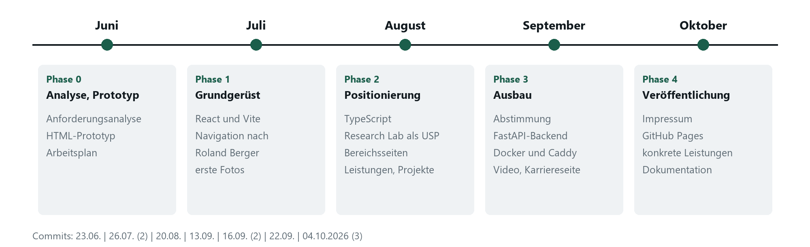

**Phase 0: Analyse und Prototyp (Juni 2026).** Am 23. Juni 2026 wurde das Repository angelegt. Parallel entstanden die Anforderungsanalyse und ein klickbarer HTML-Prototyp mit Kopfbereich, drei Bereichskacheln, Arbeitsweise und Kontakt. Beide wurden zum Abschluss der Phase abgegeben.

**Phase 1: Grundgerüst (Juli 2026).** Der Prototyp wurde in eine React-Anwendung mit Vite und Tailwind CSS überführt. Gestaltung und Navigation orientierten sich bereits an Roland Berger (siehe Abschnitt 3.3). Mit dem zweiten Commit kamen erste Fotos, Publikationen, der Abschnitt Über uns und die Oberfläche des Kontaktformulars hinzu.

**Phase 2: Positionierung und Struktur (August 2026).** Diese Phase brachte den größten Umbau. Das Projekt wurde auf TypeScript umgestellt, die Inhalte wurden in typisierte Datenmodelle überführt. Die Positionierung wurde geschärft, die Begriffe wurden vereinheitlicht, und jede Bereichsseite erhielt acht Abschnitte nach dem Vorbild von Beratungs- und Technologieanbietern. Dazu kamen ein neues Logo sowie die Abschnitte Leistungen und Kundenprojekte.

**Phase 3: Abstimmung und Ausbau (September 2026).** Nach einer Abstimmung mit dem Auftraggeber wurden Farbwelt, Leistungen und Kundenprojekte angepasst. Es entstanden das FastAPI-Backend für das Kontaktformular, die Containerkonfiguration für den Betrieb, das Hintergrundvideo, das Publikationskarussell, die Karriereseite mit Stellenfilter und ein Diagramm. Die Gestaltung wurde auf ein helles Farbsystem mit einer Akzentfarbe umgestellt.

**Phase 4: Veröffentlichung und Abschluss (Oktober 2026).** Das Impressum wurde mit Musterdaten und einem Hinweis auf den fiktiven Charakter versehen. Diese Dokumentation wurde überarbeitet. Für die Veröffentlichung wurde die Website so angepasst, dass sie zusätzlich ohne Backend auf GitHub Pages läuft. Am 4. Oktober 2026 ging sie dort online (siehe Kapitel 8). Danach wurden die drei Bereichsseiten mit konkreten Leistungen neu gefasst (siehe Abschnitt 4.6).

Tabelle: Entwicklungsstände laut Versionsverwaltung

| Datum | Commit | Umfang | Inhalt |
| --- | --- | --- | --- |
| 23.06.2026 | b7e5fa1 | 1 Datei | leeres Repository mit README |
| 26.07.2026 | f8372ca | 27 Dateien, 4.228 Zeilen | Grundgerüst mit React und Vite, Startseite mit Kopfbereich, Bereichen, Arbeitsweise und Kontakt |
| 26.07.2026 | 23b95ae | 30 Dateien | erste Fotos, Publikationen, Über uns, Kontaktformular in der Oberfläche |
| 20.08.2026 | 3b57cd3 | 64 Dateien | TypeScript, Detailseiten mit acht Abschnitten, Leistungen, Kundenprojekte, Logo, Änderungsprotokoll |
| 13.09.2026 | 2197c2b | 36 Dateien | FastAPI-Backend, Docker und Caddy, Karussell, erstes Hintergrundvideo, neutrale Farbwelt |
| 16.09.2026 | d398538 | 63 Dateien | Hintergrundvideo als eigenes Modul, Bildbehandlung per Skript, neue Motive, gemeinsame Bausteine |
| 16.09.2026 | 7b200f4 | 66 Dateien | helles Farbsystem, Karriereseite mit Stellenfilter, Diagramm, neue Navigation |
| 22.09.2026 | c48e57c | 17 Dateien | abgestufte Bereichskarten, dunklere Grautöne, korrigierte Servicezeile |
| 04.10.2026 | 469291d | 37 Dateien | Impressum mit Musterdaten, Projektdokumentation, Veröffentlichung über GitHub Pages |
| 04.10.2026 | 8ff55c3 | 5 Dateien | Dokumentation auf den veröffentlichten Stand gebracht |
| 04.10.2026 | f5d9d36 | 22 Dateien | Bereichsseiten mit konkreten Leistungen, Reitern und Projektbeispielen |

## Abgleich mit dem Arbeitsplan

Der Arbeitsplan wurde in den Grundzügen eingehalten, wich aber in drei Punkten ab. Tabelle 4 stellt Plan und tatsächlichen Verlauf gegenüber.

Tabelle: Abgleich von Arbeitsplan und tatsächlichem Verlauf

| Arbeitspaket laut Plan | geplant | tatsächlich | Bemerkung |
| --- | --- | --- | --- |
| Werkzeuge, Grundgerüst | Woche 1 bis 2 (Juli) | Juli | wie geplant |
| Kopfbereich, Navigation, Bereiche | Woche 3 bis 5 (Juli) | Juli bis August | im August deutlich erweitert |
| Responsive Design, Animationen | Woche 6 bis 7 (August) | August bis September | ohne Framer Motion, eigene Lösung |
| Backend mit Datenbank und Registrierung | Woche 8 (August) | September | auf das Kontaktformular beschränkt |
| Frontend und Backend verbinden | Woche 9 (September) | September | wie geplant |
| Server und Livegang | Woche 10 bis 11 (September) | Oktober | online über GitHub Pages, eigene Domain folgt |
| Testen und Abschluss | Woche 12 bis 13 (September) | September bis Oktober | laufend statt am Ende |

Die erste Abweichung betrifft das Backend. Geplant waren eine Datenbank und eine Registrierung. Im Projektverlauf wurde entschieden, auf ein Benutzerkonto vorerst zu verzichten. Das Backend übernimmt deshalb nur den Versand des Kontaktformulars. Die zweite Abweichung betrifft die Animationen. Statt der Bibliothek Framer Motion wird eine eigene Komponente auf Basis des Browser-Standards IntersectionObserver genutzt. Sie kommt ohne zusätzliche Abhängigkeit aus und berücksichtigt die Systemeinstellung zur Bewegungsreduktion. Die dritte Abweichung betrifft den Livegang. Er verschob sich um rund drei Wochen, weil Inhalte und Gestaltung nach der Abstimmung im September noch einmal umfangreich überarbeitet wurden. Statt des geplanten eigenen Servers ging die Website zunächst über GitHub Pages online.

# Analyse etablierter Beratungswebsites

## Vorgehen der Analyse

Um Entscheidungen zu Struktur und Gestaltung methodisch zu begründen, wurden die Webauftritte etablierter Beratungs- und Technologieunternehmen untersucht. Die Auswahl umfasst eine Strategieberatung mit deutschen Wurzeln (Roland Berger), zwei internationale Strategieberatungen (Boston Consulting Group, McKinsey & Company), ein IT-Dienstleistungsunternehmen (Capgemini) sowie einen mittelständischen Technologieberater aus der Region (CodeCamp:N). Hinzu kamen mehrere kleinere deutsche KI-Beratungen.

Die Analyse folgte fünf Kriterien:

1. Navigation und Informationsarchitektur
2. Aufbau der Startseite und Reihenfolge der Abschnitte
3. Darstellung von Leistungen, Vorgehen und Fallbeispielen
4. Umgang mit Forschung und Publikationen
5. Aufbau der Karriereseite

Die Analysen fanden zu verschiedenen Zeitpunkten im Projekt statt, jeweils dann, wenn ein Bereich der Website überarbeitet wurde. Zur Überprüfung wurden die Websites am 4. Oktober 2026 erneut abgerufen. Wo sich der Stand seitdem geändert hat, ist das vermerkt.

## Ergebnisse je Unternehmen

**Roland Berger.** Die Hauptnavigation gliedert sich in Expertise, Publikationen, Über uns, Standorte und Karriere [1]. Oberhalb liegt eine schmale Servicezeile mit Kontakt, Newsroom, Suche und Sprachwahl. Die Startseite beginnt mit einem großen Kopfbereich mit Bild und führt über Studien und Artikel zu einem Abschnitt für Bewerber und zum Kontakt. Die Gestaltung ist zurückhaltend mit hellen Flächen, dunkler Schrift und hochwertiger Fotografie. Auffällig ist die Gliederung der Leistungsseiten in Cluster je Leistung.

**Boston Consulting Group.** Die Navigation trennt Leistungen, Insights, Unternehmen und Karriere [2]. Die Startseite stellt Fallbeispiele mit messbarem Ergebnis in den Vordergrund, sogenannte Client Impact Stories. Mit dem BCG Henderson Institute betreibt das Unternehmen ein eigenes Institut, das Forschung sichtbar vom Beratungsgeschäft abgrenzt [3]. Die Karriereseite ist nach Einstiegswegen gegliedert (Berufserfahrene, Einsteiger, Praktika), bietet eine Stellensuche mit Standortfilter und Erfahrungsberichte von Mitarbeitenden [4].

**McKinsey & Company.** Auch hier bildet ein eigenes Forschungsinstitut, das McKinsey Global Institute, die Grundlage zahlreicher Veröffentlichungen [5]. Publikationen werden nach Typ und Thema gegliedert und mit Datum versehen.

**Capgemini.** Die Navigation gliedert sich in Insights, Branchen, Services, Karriere, News und Über uns [6]. Kundenprojekte werden als eigene Inhaltsart geführt und namentlich mit Unternehmen verknüpft. Die Bildsprache arbeitet mit großformatiger Fotografie und Illustration.

**CodeCamp:N.** Der Nürnberger Technologieberater richtet sich ausdrücklich an Versicherungen, Banken und den Mittelstand [7]. Laut Projektprotokoll vom August 2026 beschrieb die Website zu diesem Zeitpunkt einen Einstieg in zwei Phasen, eine kurze Standortbestimmung und das anschließende Projekt. Beim erneuten Abruf im Oktober 2026 war diese Darstellung auf der Startseite nicht mehr erkennbar. Das Angebot wird dort jetzt als durchgehender Weg von der Reifegradanalyse bis zur Umsetzung beschrieben.

**Kleinere KI-Beratungen.** Mehrere deutsche Anbieter für KI im Mittelstand arbeiten mit klar umrissenen Einstiegsformaten, einem Vorgehen in drei bis vier Schritten mit Zeitangaben und häufigen Fragen am Seitenende. Häufig finden sich zudem Preistabellen, Selbsttests und Newsletter-Kästen.

**SAP- und Logistikberatungen.** Für die Überarbeitung der Bereichsseiten im Oktober 2026 wurden zusätzlich Referenzen spezialisierter SAP-Beratungen ausgewertet. Sie beschreiben ihre Leistungen nicht abstrakt, sondern über Systeme und Projekttypen, etwa den Aufbau eines Logistik-Templates mit SAP EWM und dessen Rollout auf weitere Standorte [27].

## Übernahme in das Projekt im zeitlichen Verlauf

Die Erkenntnisse flossen nicht auf einmal ein, sondern Schritt für Schritt. Tabelle 5 ordnet jede Übernahme der Phase zu, in der sie umgesetzt wurde.

Tabelle: Übernommene Muster nach Projektphase

| Phase | Vorbild | Muster | Umsetzung bei stonetree |
| --- | --- | --- | --- |
| 1 (Juli) | Roland Berger | ruhige, monochrome Gestaltung mit Wechsel heller und dunkler Flächen | erste Farbwelt in Grautönen ohne Akzentfarbe |
| 1 (Juli) | Roland Berger | Hauptnavigation Expertise, Publikationen, Über uns, Kontakt | Navigation Übersicht, Expertise, Publikationen, Über uns, Kontakt |
| 1 (Juli) | Roland Berger | Servicezeile über der Hauptnavigation | Servicezeile mit Publikationen, Research Lab, Kontakt, Karriere, Sprachwahl |
| 1 (Juli) | BCG, Capgemini | echte Arbeitssituationen statt abstrakter Grafiken | Fotos statt Illustrationen, abstrakte Motive verworfen |
| 2 (August) | Roland Berger | Leistungsseiten mit Clustern je Leistung | sechs Leistungsbausteine je Bereich, jeweils mit Ergebnis (im Oktober durch Leistungsfelder ersetzt) |
| 2 (August) | CodeCamp:N | Einstieg über eine kurze Standortbestimmung vor dem Projekt | Einstiegsformate mit Umfang, etwa eine Standortbestimmung über vier bis sechs Wochen |
| 2 (August) | KI-Beratungen | Vorgehen in Schritten mit Dauer, häufige Fragen | Vorgehen in vier Schritten mit Zeitangabe, fünf häufige Fragen je Bereich |
| 2 (August) | BCG, McKinsey | eigenes Forschungsinstitut als Beleg für Kompetenz | Research Lab als eigener Bereich mit typisierten Publikationen |
| 3 (September) | BCG | Fallbeispiele mit messbarem Ergebnis | Kennzahl als erstes Element jeder Projektkarte |
| 3 (September) | Roland Berger, BCG | ruhige Bewegtbilder im Kopfbereich | stummes Hintergrundvideo mit Pausenknopf |
| 3 (September) | BCG | Karriereseite nach Einstiegswegen, Stellensuche mit Filter, Erfahrungsberichte | Karriereseite mit vier Einstiegswegen, drei Filtern und drei Zitaten |
| 3 (September) | Roland Berger | Ausklappmenüs mit Unterpunkten | zwei Ausklappmenüs mit Vorschaukarte |
| 4 (Oktober) | SAP- und Logistikberatungen | Leistungen nach Systemen und Projekttypen benannt, Template-Rollouts als Referenz | Consulting mit SAP-Beratung und Logistik-Templates |
| 4 (Oktober) | KI-Beratungen | Anwendungsfälle nach Unternehmensbereich mit Dauer bis zum Pilot | zwölf Anwendungsfälle in vier Reitern |

## Bewusst nicht übernommene Muster

Nicht jedes Muster passt zu einem kleinen Anbieter mit nüchterner Ansprache. Vier Elemente wurden bewusst verworfen:

- **Preistabellen.** Beratungsleistungen im Mittelstand werden individuell vereinbart. Feste Preise würden eine Vergleichbarkeit vortäuschen.
- **Selbsttests und Reifegrad-Quiz.** Sie erzeugen Kontaktdaten, liefern aber wenig Erkenntnis und passen nicht zur sachlichen Tonalität.
- **Newsletter-Kästen.** Sie unterbrechen den Lesefluss und setzen einen regelmäßigen Redaktionsprozess voraus, der für ein kleines Team unrealistisch ist.
- **Kundenstimmen mit Namen.** Ohne echte Kunden wären sie erfunden und damit unredlich. Fallbeispiele erscheinen deshalb anonymisiert.

Ebenfalls nicht übernommen wurde die Gliederung nach Branchen, wie sie Capgemini und BCG verwenden. Eine Branchengliederung wurde im August umgesetzt und nach Rücksprache mit dem Auftraggeber im September wieder entfernt. Für ein Unternehmen mit drei Bereichen erzeugte sie mehr Navigation als Inhalt.

## Zwischenfazit

Die Analyse zeigt ein gemeinsames Muster großer Beratungen: Kompetenz wird nicht behauptet, sondern durch Fallbeispiele, Publikationen und ein eigenes Forschungsinstitut belegt. Für stonetree bot sich das Research Lab als Entsprechung an. Daraus entstand die Positionierung, die Kapitel 4 beschreibt.

# Inhaltliche Ausarbeitung

## Positionierung

Der Unterschied von stonetree liegt im eigenen Research Lab. Das Unternehmen erprobt Methoden und KI-Verfahren zuerst selbst und bringt nur das in Kundenprojekte, was sich bewährt hat. Daraus wurde der Leitsatz der Website abgeleitet: aus eigener Forschung, in die Praxis gebracht, bis zur laufenden Lösung.

Dieser Satz steht nicht nur im Kopfbereich, er bestimmt den Aufbau der ganzen Website. Jeder Abschnitt belegt einen Teil davon:

- Expertise zeigt, dass Forschung ein eigener Bereich ist und nicht nur ein Schlagwort.
- Leistungen zeigen den Weg von der Strategie bis zum Betrieb.
- Kundenprojekte zeigen, was am Ende herauskommt.
- Publikationen belegen die Forschung mit Beiträgen.
- Die Karriereseite nutzt das Research Lab als Argument für Bewerber.

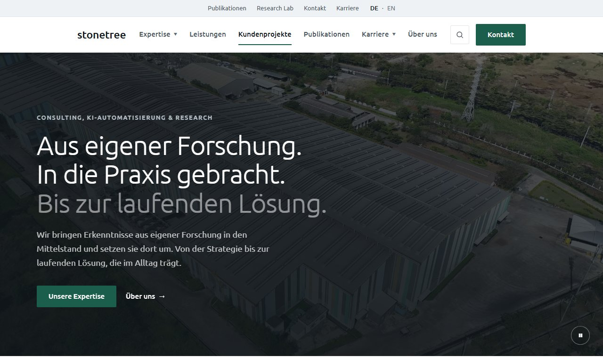

## Zielgruppen

Tabelle: Zielgruppen und ihre Fragen an die Website

| Zielgruppe | Was sie sucht | Wo die Website antwortet |
| --- | --- | --- |
| Geschäftsführung im Mittelstand | Kann das jemand umsetzen, nicht nur beraten? | Leistungen 01 bis 06, Kundenprojekte mit Kennzahl, Vorgehen mit Dauer |
| Fachbereich oder IT | Was wird konkret angeboten, und wie läuft ein Projekt ab? | Bereichsseiten mit Leistungsfeldern, Projektbeispielen, Vorgehen und Fragen |
| Bewerberinnen und Bewerber | Wie arbeitet man dort und wie bewirbt man sich? | Karriereseite mit Einstiegswegen, Bewerbungsprozess, Stellen, Einblicken |
| Hochschulen | Gibt es Kooperationen und Abschlussarbeiten? | Research Lab und Abschnitt Forschung auf der Karriereseite |

## Begriffssystem

Zu Beginn der zweiten Phase wurden die Begriffe vereinheitlicht. Vorher standen für dieselbe Sache verschiedene Wörter auf der Website. Das wirkt unsauber und erschwert das Auffinden über Suchmaschinen.

Tabelle: Vereinheitlichung der Begriffe

| vorher | nachher | Begründung |
| --- | --- | --- |
| Beratung (als Bereich) | Consulting | Der Bereich heißt intern so, die Kundschaft kennt den Begriff. |
| AI Automation | KI-Automatisierung | Deutsche Website, deutscher Begriff, auch im Adresspfad. |
| Forschung (als Schlagwort) | Research | Der Bereich heißt Research Lab, das Kürzel passt dazu. |
| unabhängiges Beratungshaus | mehr als reines Consulting | Das Wort Beratungshaus war Selbstbeschreibung ohne Inhalt. |
| /bereiche/beratung | /bereiche/consulting | Die alte Adresse leitet weiter, damit keine Links brechen. |

## Sprachregeln

Für alle Texte gelten feste Regeln. Sie sind hier festgehalten, damit spätere Ergänzungen dazu passen:

- Kurze Sätze mit einem Gedanken pro Satz.
- Keine Gedankenstriche als Einschub, stattdessen Punkt oder Komma.
- Keine Floskeln wie ganzheitlich, maßgeschneidert, auf Augenhöhe oder an der Schnittstelle von.
- Konkrete Angaben statt Superlative, also vier bis sechs Wochen statt in kürzester Zeit.
- Sie-Ansprache gegenüber Kundschaft und Bewerbern.
- Jede Behauptung wird durch eine Zahl oder ein Beispiel gestützt.
- Wo Zahlen erfunden sind, steht ein Hinweis direkt daneben.

Tabelle: Beispiele aus der Überarbeitung der Texte

| Stelle | vorher | nachher |
| --- | --- | --- |
| Überschrift Kopfbereich | Klare Strategien. Intelligente Prozesse. Echte Forschung. | Aus eigener Forschung. In die Praxis gebracht. Bis zur laufenden Lösung. |
| Tagline | Beratung für den Mittelstand | Eigene Forschung, im Mittelstand umgesetzt. Von der Strategie bis zur laufenden Lösung. |
| Über uns | stonetree ist ein unabhängiges Beratungshaus | stonetree ist mehr als reines Consulting. Wir betreiben eigene angewandte Forschung. |

## Aufbau der Startseite

Die Reihenfolge der Abschnitte folgt den Fragen, die sich eine Besucherin beim Lesen stellt: erst wer wir sind, dann was wir können, dann was dabei herauskommt, dann der Beleg, dann das Unternehmen, dann der Kontakt.

Tabelle: Abschnitte der Startseite

| Abschnitt | Frage der Leserin | Inhalt |
| --- | --- | --- |
| Kopfbereich | Worum geht es hier? | Kernsatz, kurzer Absatz, zwei Wege weiter |
| Expertise | Was können die? | drei Bereiche als Karten mit Weg zur Detailseite |
| Leistungen | Was genau bekomme ich? | sechs Bausteine von Strategie bis Nachhaltigkeit |
| Kundenprojekte | Funktioniert das auch? | drei Fälle mit Kennzahl, Ausgangslage und Vorgehen |
| Diagramm | Wie viel bringt das? | Aufwand vor und nach einer Automatisierung |
| Publikationen | Ist die Forschung echt? | sechs Beiträge mit Typ und Datum |
| Über uns | Wer steckt dahinter? | drei Absätze, drei Kennzahlen, Arbeitsweise |
| Kontakt | Wie komme ich ins Gespräch? | kurze Ansprache, Formular, direkte Adresse |

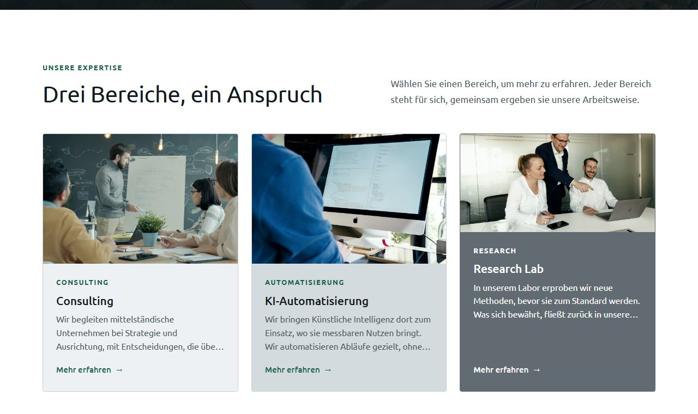

## Die drei Bereichsseiten

Jeder Bereich hat eine eigene Seite. Alle drei Seiten sind gleich aufgebaut. Das erleichtert den Vergleich und reduziert den Erklärungsaufwand.

In der ersten Fassung bestand jede Bereichsseite aus drei Absätzen Fließtext, einem Dreispalter, vier Ausgangslagen, sechs Leistungsbausteinen und sechs typischen Aufgaben, gefolgt von Vorgehen, Einstieg und Fragen. Die Rückmeldung im Oktober 2026 lautete, dass diese Menge an Text kaum gelesen wird und das Angebot dennoch abstrakt bleibt. Begriffe wie Standortbestimmung oder Zielbild sagen wenig darüber, was ein Unternehmen tatsächlich einkaufen kann.

Die Seiten wurden deshalb nach zwei Grundsätzen neu gefasst. Erstens konkrete Leistungen statt allgemeiner Bausteine: Consulting nennt SAP-Beratung, Logistik-Templates und Managementberatung beim Namen, KI-Automatisierung zeigt zwölf Anwendungsfälle mit Pilotdauer und betroffenen Systemen, das Research Lab nennt seine Vorhaben mit Laufzeit und Stand. Zweitens überfliegbare Form statt Fließtext: Jede Leistung besteht aus einem Satz, Schlagworten und Eckdaten. Die Leistungsfelder stehen als Reiter nebeneinander, sodass immer nur drei Karten gleichzeitig sichtbar sind.

Tabelle: Aufbau einer Bereichsseite vor und nach der Überarbeitung

| Abschnitt | vorher | nachher |
| --- | --- | --- |
| Einleitung | drei Absätze und Dreispalter | ein bis zwei Sätze und drei Eckdaten |
| Leistungen | vier Ausgangslagen, sechs Bausteine, sechs Aufgaben | drei bis vier Reiter mit je drei Karten aus einem Satz, Schlagworten und Eckdaten |
| Projektbeispiele | keine | drei Fälle mit Kennzahl, Details aufklappbar |
| Vorgehen | vier Schritte mit je zwei Sätzen | vier Schritte mit je einem Satz |
| Einstieg | drei Formate mit bis zu vier Punkten | drei Formate mit je drei Punkten |
| Häufige Fragen | fünf Fragen | vier Fragen |

Tabelle: Leistungsfelder je Bereich

| Bereich | Reiter | Beispiele für Leistungen |
| --- | --- | --- |
| Consulting | SAP-Beratung, Logistik und Supply Chain, Management und Strategie, Organisation und Projekte | Umstieg auf S/4HANA, Clean Core, Logistik-Template mit SAP EWM, Rollout an Standorten, Business Case, Programmmanagement |
| KI-Automatisierung | Finanzen und Einkauf, Vertrieb und Service, Produktion und Logistik, Wissen und Verwaltung | Rechnungseingang, Service-Postfach, Angebotsentwürfe, Bedarfsprognose, Sichtprüfung, Wissensassistent |
| Research Lab | KI-Entwicklung, SAP-Optimierung, Automatisierung und Agenten | kleine Sprachmodelle, KI im eigenen Rechenzentrum, Process Mining auf SAP-Daten, KI-gestützte Code-Analyse, Agenten mit Freigabegrenzen |

Die Inhalte orientieren sich an realen Angeboten. Die Standardwartung für SAP ECC 6.0 endet am 31. Dezember 2027, die verlängerte Wartung läuft gegen Aufpreis bis Ende 2030 [26]. Für viele Mittelständler ist der Umstieg auf S/4HANA deshalb das drängendste IT-Thema. Spezialisierte Beratungen führen Logistik-Templates zunächst an einem Standort ein und rollen sie danach auf weitere Werke aus [27]. Bei der KI-Automatisierung gelten die Verarbeitung von Eingangsrechnungen und die Sortierung von Service-Postfächern als Anwendungsfälle mit besonders günstigem Verhältnis von Aufwand und Nutzen [28]. Bewusst nicht aufgenommen wurde die automatische Vorauswahl von Bewerbungen, weil KI-Systeme im Personalbereich nach der KI-Verordnung als Hochrisiko-Systeme gelten [8].

Die Unterschiede zwischen den Bereichen stehen in den Daten, nicht im Code. Im Research Lab heißen die Leistungen Forschungsfelder und tragen zusätzlich einen Stand (laufend, abgeschlossen, geplant). Die Projektbeispiele heißen dort Transfer und zeigen, welche Ergebnisse des Labs in Kundenprojekte übernommen wurden. Unternehmen und Kennzahlen der Beispiele sind Platzhalter und als solche gekennzeichnet.

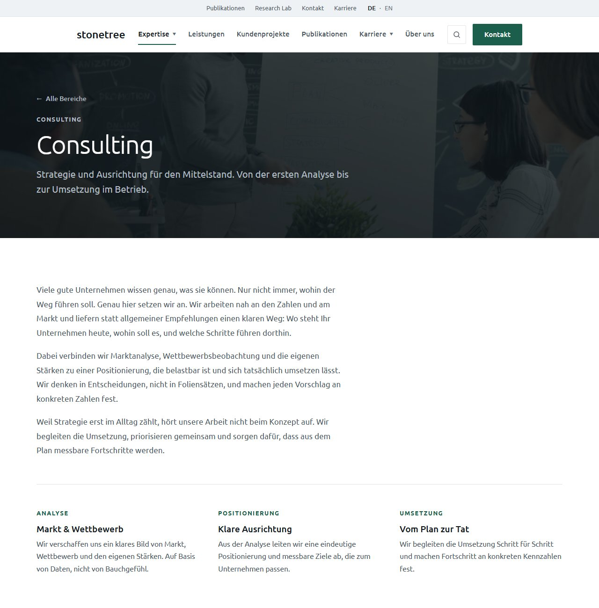

## Leistungen

Sechs Bausteine stehen in der Reihenfolge, in der gearbeitet wird. Die Nummern 01 bis 06 zeigen den roten Faden vom Zielbild bis zum Betrieb.

Tabelle: Leistungsbausteine

| Nr. | Baustein | Kernaussage |
| --- | --- | --- |
| 01 | Strategie und Management | Standortbestimmung, Zielbild und Steuerung |
| 02 | KI-Automatisierung | Abläufe durchgängig automatisieren, KI nur dort, wo sie Nutzen bringt |
| 03 | Target Operating Model | Zielbild für Struktur, Prozesse, Steuerung und Technologie |
| 04 | Umsetzungsfahrplan | Pakete, Reihenfolge, Verantwortliche, Meilensteine |
| 05 | Umsetzungsbegleitung | dabeibleiben, bis die neuen Abläufe im Alltag tragen |
| 06 | Nachhaltigkeit | Wirkung messen und Berichtspflichten effizient erfüllen |

## Kundenprojekte

Drei anonymisierte Fälle folgen demselben Muster aus Ausgangslage, Vorgehen und Ergebnis. Nach dem Vorbild der Fallbeispiele bei BCG steht die Kennzahl über dem Text. Vorher stand die Wirkung nur im Fließtext und ging unter. Ausgangslage und Vorgehen sind aufklappbar. So bleibt die Karte kurz, ohne dass Inhalt verloren geht.

Tabelle: Kundenprojekte

| Fall | Bausteine | Kennzahl | Laufzeit |
| --- | --- | --- | --- |
| Energieversorger | KI-Automatisierung | 70 % der Anfragen ohne manuelle Sichtung | bis 6 Monate |
| Regionalbank | Digital Maturity Assessment, Impact Assessment | 9 von 34 Vorhaben gestoppt | bis 6 Monate |
| Kommunale Verwaltung | IT-Automatisierung, Organisationsdesign | 45 % weniger Zeit für Routineaufgaben | bis 6 Monate |

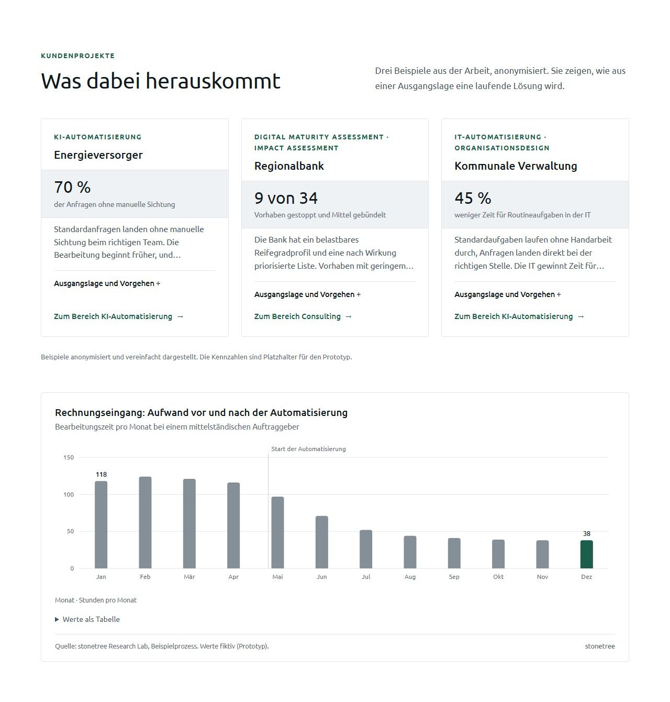

## Publikationen und Research Lab

Sechs Beiträge erscheinen in umgekehrter zeitlicher Reihenfolge und mit vier Typen: Paper, Research Note, Whitepaper und Praxisbericht. Die Typen machen sichtbar, dass nicht jeder Beitrag dasselbe Gewicht hat. Zwei Beiträge sind mit einem PDF hinterlegt. Ein Beitrag ohne PDF trägt den Hinweis PDF folgt statt eines toten Links. Inhaltlich greifen die Beiträge aktuelle Themen auf, etwa die Anforderungen der europäischen KI-Verordnung [8].

Tabelle: Publikationen des Research Lab

| Typ | Titel | Datum |
| --- | --- | --- |
| Paper | Wann sich end-to-end-Automatisierung im Mittelstand rechnet, und wann nicht | August 2026 |
| Research Note | Grenzen von Large Language Models in regulierten Freigabeprozessen | Juli 2026 |
| Paper | Prozessdaten als Grundlage für KI-gestützte Entscheidungen in kleinen Organisationen | Juni 2026 |
| Whitepaper | KI im Mittelstand: Wo Automatisierung 2026 wirklich Wirkung zeigt | Mai 2026 |
| Praxisbericht | Von der Insellösung zum durchgängigen Ablauf | April 2026 |
| Research Note | Datenqualität zuerst: Warum Automatisierung ohne saubere Prozessdaten scheitert | März 2026 |

Die Startseite zeigt die Beiträge als Karussell. Die vollständige Liste liegt im Research Lab, weil sie inhaltlich dorthin gehört.

## Über uns

Die frühere Kennzahlenleiste zeigte 2026, 3, Mittelstand und Hands-on. Das sind Schlagworte, keine Kennzahlen. Jetzt stehen dort drei Werte mit Aussagekraft.

Tabelle: Kennzahlen im Abschnitt Über uns

| Wert | Beschriftung | Herkunft |
| --- | --- | --- |
| 4,5 Monate | durchschnittliche Projektdauer | fiktiv, als Platzhalter gekennzeichnet |
| 70 % | Projekte mit Umsetzungsbegleitung | fiktiv, als Platzhalter gekennzeichnet |
| 6 | Veröffentlichungen aus dem Research Lab | aus den hinterlegten Beiträgen gezählt |

## Karriereseite

Die Karriereseite orientiert sich am Aufbau der Karriereseiten großer Beratungen (siehe Abschnitt 3.2). Dort steht zuerst der Grund, dann der Weg hinein, dann der Ablauf und zuletzt die Stellenliste.

Tabelle: Aufbau der Karriereseite

| Abschnitt | Inhalt | Begründung der Position |
| --- | --- | --- |
| Kopfbereich | Kicker, kurzer Titel, ein Satz, Button zu den Stellen | Wer nur Stellen sucht, springt sofort weiter. |
| Warum stonetree | vier Punkte ohne Bilder | Zuerst der Grund, sonst wirkt die Stellenliste beliebig. |
| Einstiegswege | Praktikum, Werkstudium, Berufseinstieg, Berufserfahrene | Jede Person findet den eigenen Weg mit einem Klick. |
| Research Lab | Abschlussarbeiten, Kooperationen, Veröffentlichungen | Das bieten große Beratungen so nicht. |
| Bewerbungsprozess | fünf Schritte mit Dauer | Nimmt die Unsicherheit über die Dauer. |
| Offene Stellen | acht Stellen, drei Filter | Der eigentliche Zweck der Seite. |
| Einblicke | drei Zitate mit Porträt | Menschen wirken glaubhafter als Adjektive. |
| Häufige Fragen | sechs Fragen | Homeoffice, Reisen, Quereinstieg, Abschlussarbeit |
| Ansprechperson | Foto, Rolle, Adresse | Eine Person statt eines anonymen Postfachs. |

Die acht Stellen decken alle drei Bereiche ab, dazu vier Standorte und fünf Arten vom Praktikum bis zur Abschlussarbeit. Die Filter greifen auf dieselben Listen zu, aus denen die Stellen gebaut sind. Neue Werte erscheinen dadurch automatisch im Filter.

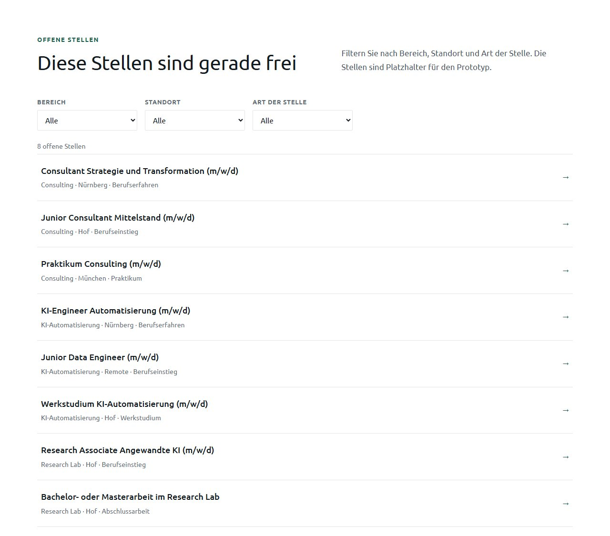

## Visualisierung von Kennzahlen

Bis zur dritten Phase enthielt die Website keine einzige Abbildung mit Zahlen. Neu ist ein Diagramm auf der Startseite. Es zeigt den Aufwand im Rechnungseingang vor und nach einer Automatisierung in Stunden pro Monat über zwölf Monate. Eine senkrechte Linie markiert den Start der Automatisierung. Die Gestaltung folgt vier Regeln:

- Genau ein Wert ist farbig hervorgehoben, der letzte Monat mit 38 Stunden.
- Alle anderen Säulen bleiben grau, damit die Aussage klar bleibt.
- Beschriftet sind nur der erste und der hervorgehobene Wert.
- Unter dem Diagramm steht dieselbe Reihe als Tabelle, für Vorlesesoftware und zum Nachlesen.

## Bildsprache

Das Handschlagbild und das Dashboard-Symbolbild wurden entfernt. Beide zeigen keine Arbeit, sondern eine Idee von Arbeit. Stattdessen zeigen die Motive echte Arbeitssituationen: Erklärung am Whiteboard, Blick über die Schulter auf einen Bildschirm, Besprechung am Tisch, Werkstatt und Produktion.

Damit die Bilder zusammenpassen, durchlaufen alle dieselbe Behandlung per Skript: mittig zugeschnitten, leicht entsättigt, kühler Weißabgleich und eine gemeinsame mittlere Helligkeit. Porträts sind schwarzweiß. Quellen sind ausschließlich Unsplash und Pexels [9][10].

## Platzhalter, Impressum und Redlichkeit

Ein Prototyp mit erfundenen Zahlen birgt das Risiko, für echt gehalten zu werden. Deshalb ist überall gekennzeichnet, was nicht echt ist.

Tabelle: Kennzeichnung der Platzhalter

| Platzhalter | Kennzeichnung auf der Website |
| --- | --- |
| Kennzahlen der Kundenprojekte | Hinweis unter den Karten |
| Projektdauer und Anteil Umsetzungsbegleitung | Hinweis unter der Kennzahlenleiste |
| Personen und Zitate auf der Karriereseite | Hinweis unter den Zitaten |
| Stellenanzeigen | Hinweis im Einleitungssatz des Abschnitts |
| Bewerbungsadresse | Hinweis unter dem Button |
| Werte im Diagramm | Quellenzeile unter dem Diagramm |
| Firmendaten | Impressum mit Musterdaten und Hinweis auf die fiktive Website, Hinweis in der Fußzeile jeder Seite |

Das Impressum steht seit Oktober 2026 auf einer eigenen Seite. Es enthält alle Angaben, die § 5 DDG für ein echtes Unternehmen verlangt [11], sowie die Angabe der inhaltlich verantwortlichen Person nach § 18 Abs. 2 MStV [12]. Alle Angaben sind Musterdaten auf den Namen Max Mustermann. Vor den Angaben steht ein deutlich abgesetzter Hinweis, dass die Website fiktiv ist, im Rahmen eines Hochschulprojekts entstand und keine Leistungen anbietet.

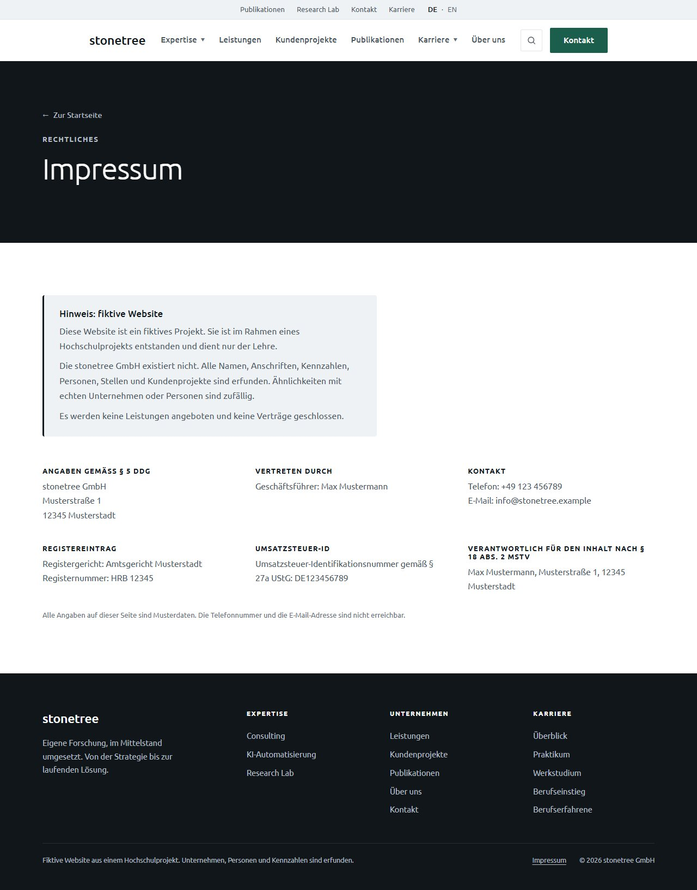

## Barrierefreiheit als inhaltliche Aufgabe

Barrierefreiheit betrifft nicht nur die Technik, sondern auch die Texte. Die Website orientiert sich an den WCAG 2.2 [13]:

- Jedes Bild hat einen beschreibenden Alternativtext in den Daten.
- Überschriften folgen einer Hierarchie mit genau einer Hauptüberschrift je Seite.
- Links tragen für Vorlesesoftware zusätzlich den Titel der Karte.
- Das Hintergrundvideo lässt sich anhalten, weil bewegte Inhalte über fünf Sekunden das nach Erfolgskriterium 2.2.2 erfordern.
- Die Reiter der Bereichsseiten folgen dem Tabs-Muster der WAI-ARIA Authoring Practices [29]: Pfeiltasten wechseln den Reiter, nur der aktive ist per Tabulatortaste erreichbar.
- Farben wurden gegen die Schrift rechnerisch geprüft, nicht nach Augenmaß gewählt.

# Gestaltung

## Entwicklung der Farbwelt

Die Farbwelt änderte sich im Projekt dreimal. In der ersten Phase war die Website monochrom in Grautönen nach dem Vorbild von Roland Berger. In der zweiten Phase wurde auf Wunsch des Auftraggebers eine Palette aus dem Logo abgeleitet, mit Creme und Oliv. Nach der Abstimmung im September folgte die Rückkehr zu Weiß und Grau, ergänzt um eine einzige Akzentfarbe.

Diese Wechsel zeigten, warum Farben nur an einer Stelle definiert sein dürfen. In der ersten Fassung mussten Farbwerte an vielen Stellen gesucht werden. Heute stehen alle Farben als Variablen in einer Datei, und in den Komponenten gibt es keine festen Farbwerte mehr.

Tabelle: Farbvariablen (Design-Tokens)

| Token | Wert | Verwendung |
| --- | --- | --- |
| --surface | #FFFFFF | Standardhintergrund |
| --surface-muted | #EFF2F4 | abgesetzte Sektion |
| --surface-tint | #E3E9EC | kleine Flächen wie Kennzahlen und Schlagworte |
| --surface-dark | #10161A | nur Kopfbereich und Fußbereich |
| --border, --border-strong | #E2E6E9, #C9CFD4 | Linien und Kartenrahmen |
| --text, --text-body, --text-muted | #121A1F, #4A555E, #5F6C75 | Überschrift, Fließtext, Kleinschrift |
| --text-on-dark, --text-on-dark-muted | #FFFFFF, #B4BEC5 | Schrift auf dunklen Flächen |
| --accent, --accent-hover, --accent-soft | #1B5E4B, #164C3D, #E8F1EE | Akzent Tannengrün |
| --card-ton-1 bis -3 | #EDF1F3, #D3DBDF, #626B71 | Abstufung der drei Bereichskarten |
| --chart-muted | #848F97 | Werte ohne Hervorhebung im Diagramm |
| --danger | #B42318 | Fehlermeldungen im Formular |

Zwei Abweichungen vom Auftrag sind begründet. Erstens erreicht der vorgegebene Grauton #78858E für Kleinschrift auf Weiß nur ein Kontrastverhältnis von 3,8 zu 1 und verfehlt damit die Anforderung von 4,5 zu 1 nach WCAG [13]. Er wurde auf #5F6C75 abgedunkelt (5,4 zu 1). Zweitens erreicht der Akzent auf dunklen Flächen nur 2,3 zu 1. Kicker im Kopf- und Fußbereich stehen deshalb in gedämpftem Weiß.

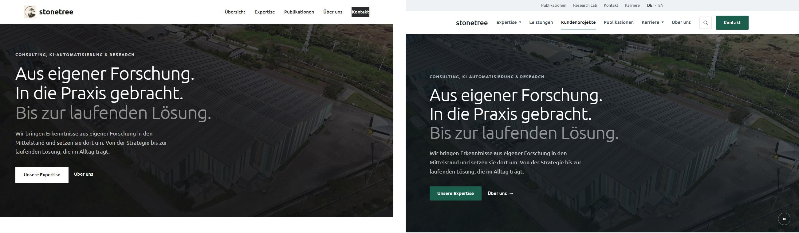

## Regeln für den Akzent

Die Akzentfarbe erscheint nur an sechs Stellen. Überall sonst ist die Website grau und weiß:

- gefüllter Hauptbutton mit weißer Schrift
- Pfeile in Links und Karten
- aktiver Navigationspunkt als Unterstrich
- Kicker über Überschriften
- die eine Hervorhebung im Diagramm
- Kartenrahmen beim Überfahren mit der Maus

Für die Entscheidung zwischen Grün und Blau lässt sich die Farbe über den Adressparameter `?akzent=blau` umschalten. Beide Varianten liegen als Screenshot im Ordner `docs/screenshots/akzent` vor.

## Helligkeit und Rhythmus

In der ersten Fassung wechselten große dunkle und helle Blöcke. Heute ist Weiß der Standard, jede zweite Sektion ist hellgrau, und dunkel sind nur noch Kopf- und Fußbereich. Die Trennung zwischen gleichfarbigen Sektionen übernimmt eine feine Linie. Die drei Bereichskarten sind abgestuft in hellem, mittlerem und kräftigem Grau. Die Abstände zwischen Sektionen betragen 96 Pixel am Desktop und 64 Pixel am Smartphone. Fließtext ist auf 68 Zeichen je Zeile begrenzt.

# Technische Umsetzung

## Technologieauswahl

Tabelle: Eingesetzte Technologien und Begründung

| Baustein | Wahl | Begründung |
| --- | --- | --- |
| Oberfläche | React 18 mit TypeScript im strikten Modus [14][15] | typisierte Datenmodelle, Fehler fallen beim Bauen auf |
| Build | Vite 6 [16] | schneller Start, einfache Konfiguration |
| Stile | eigenes CSS mit Variablen, Tailwind CSS 4 nur für Tokens [17] | wenige, klar benannte Klassen statt langer Klassenketten |
| Routing | react-router-dom 6 | Unterseiten und Anker auf der Startseite |
| Backend | FastAPI mit SMTP-Versand [18] | genau eine Aufgabe, das Kontaktformular |
| Linter | oxlint | typescript-eslint unterstützt TypeScript 7 noch nicht |
| Betrieb | Docker Compose und Caddy [19][20] | reproduzierbarer Betrieb, HTTPS automatisch |

## Projektstruktur

Die Struktur trennt drei Verantwortlichkeiten. Inhalte liegen in `src/data`, Logik mit Zustand in `src/features`, Darstellung in `src/components`. Wer einen Text ändern will, muss keinen Code lesen. Wer die Darstellung ändert, fasst keine Inhalte an.

Tabelle: Ordnerstruktur des Frontends

| Ordner | Aufgabe | Umfang |
| --- | --- | --- |
| src/data | alle Inhalte und Datenmodelle | 12 Dateien, rund 1.500 Zeilen |
| src/components/ui | wiederverwendbare Bausteine | Karte, Raster, Schritte, Punkte, Zitat, Seitenkopf |
| src/components/sections | Abschnitte der Startseite | je Abschnitt eine Datei |
| src/components/detail | Abschnitte der Bereichsseiten | Ausgangslage bis häufige Fragen |
| src/features | Logik mit Zustand | Hintergrundvideo, Karussell, Stellenfilter, Reiter, Navigation, Diagramm, Kontaktformular |
| src/pages | Seiten | Startseite, Bereich, Karriere, Impressum, Logo-Vorschau, Fehlerseite |
| src/styles | Stile nach Aufgabe getrennt | 7 Dateien, rund 2.100 Zeilen |
| scripts | Aufbereitung von Video und Bildern | zwei Shell-Skripte mit ffmpeg |

Am Kontaktformular lässt sich die Trennung beispielhaft zeigen. Die Datei `useContactForm.ts` enthält Zustand, Validierung und Versand, `ContactForm.tsx` nur die Darstellung, und `Field.tsx` ist ein wiederverwendbares Eingabefeld.

## Datenmodelle

Alle Inhalte sind über TypeScript-Schnittstellen beschrieben. Fehlt in einem Datensatz ein Pflichtfeld, bricht der Build ab. Die wichtigsten Modelle sind `Pillar` und `PillarDetail` für die Bereiche mit `PillarField`, `PillarService` und `PillarCase` für Leistungsfelder, Leistungen und Projektbeispiele, `Publication` mit dem Typ `PublicationType`, `Leistung`, `Kundenprojekt`, `Job` sowie `Site` mit `Impressum`. Auf Seite des Backends prüft das Pydantic-Modell `ContactRequest` jede Anfrage, bevor sie verarbeitet wird.

## Hintergrundvideo im Kopfbereich

Der Kopfbereich zeigt zwei stumme Clips, die weich ineinander überblenden. Das Video ist Dekoration und trägt keine Information. Ohne Video bleibt das Standbild stehen, und die Website funktioniert vollständig. In folgenden Fällen wird kein Video geladen:

- Bewegungsreduktion ist im Betriebssystem aktiviert.
- Das Fenster ist schmaler als 768 Pixel.
- Der Datensparmodus des Browsers ist aktiv.
- Die Verbindung meldet 3G oder langsamer.
- Autoplay wird verweigert oder die Datei ist fehlerhaft.

Die Prüfung läuft erst nach dem vollständigen Laden der Seite. Außerhalb des sichtbaren Bereichs hält das Video an. Die Aufbereitung übernimmt ein Skript mit ffmpeg: 1920 Pixel Breite, 25 Bilder je Sekunde, keine Tonspur, Index am Dateianfang, weniger als 6 MB je Datei.

## Weitere Funktionsbausteine

Tabelle: Weitere Funktionsbausteine

| Baustein | Lösung |
| --- | --- |
| Navigation | Servicezeile, Hauptnavigation, zwei Ausklappmenüs mit Vorschaukarte, Vollbildmenü am Smartphone |
| Aktiver Menüpunkt | auf Unterseiten über die Adresse, auf der Startseite über den sichtbaren Abschnitt |
| Stellenfilter | Auswahl steht in der Adresse, gefilterte Listen sind dadurch verlinkbar |
| Reiter | Bedienung mit Pfeiltasten, aktiver Reiter in der Adresse, das Menü Expertise verlinkt jedes Leistungsfeld direkt |
| Diagramm | Berechnung getrennt von der Darstellung, Tooltip für Maus und Tastatur, Tabelle als zweiter Zugang |
| Kontaktformular | FastAPI-Backend, Honeypot gegen Bots, Begrenzung der Anfragen je IP-Adresse, Lade- und Fehlerzustand, ohne Backend Rückfall auf das E-Mail-Programm |
| Impressum | eigene Seite, Daten zentral in `site.ts`, Hinweis auf die fiktive Website |

## Backend für das Kontaktformular

Ursprünglich war ein Versand über einen externen Formulardienst denkbar. Dieser Weg wurde aus Datenschutzgründen verworfen, weil die Anfragen sonst über einen weiteren Anbieter laufen würden. Stattdessen nimmt ein eigenes FastAPI-Backend die Anfrage unter `POST /api/contact` entgegen, prüft sie und versendet sie per SMTP an ein festgelegtes Postfach.

Drei Schutzmechanismen begrenzen Missbrauch. Ein unsichtbares Feld (Honeypot) erkennt einfache Bots, die dieselbe Antwort wie Menschen erhalten. Eine Begrenzung erlaubt standardmäßig fünf Anfragen je IP-Adresse in zehn Minuten. Ist der Mailversand nicht eingerichtet, antwortet das Backend mit einem klaren Fehlercode, statt Anfragen stillschweigend zu verwerfen. Der Endpunkt `GET /api/health` meldet, ob der Mailversand konfiguriert ist.

# Qualitätssicherung und Evaluation

## Automatisierte Prüfungen

- Typprüfung mit strikten Einstellungen. Der Build bricht bei Fehlern ab.
- Linter oxlint ohne Befund.
- Acht automatisierte Tests im Backend, alle erfolgreich (Stand 4. Oktober 2026).
- Tastaturbedienung der Reiter auf den Bereichsseiten automatisiert im Browser geprüft: Pfeiltasten, Pos1 und Ende wechseln den Reiter, Fokus und Adresse folgen, nur der aktive Reiter ist per Tabulatortaste erreichbar.

## Kontraste und Lesbarkeit

Kontraste wurden mit eigenen Skripten berechnet. Für den Kopfbereich mit Video wurde die Lesbarkeit über alle Bilder beider Clips geprüft, mit einem Bild pro Sekunde bei 1024, 1440 und 1920 Pixeln Breite, jeweils am hellsten Punkt unter jedem Textblock. Mit der ursprünglichen Abdunklung erreichte die dritte Zeile der Überschrift nur 3,75 zu 1. Nach Anpassung des Verlaufs liegt der schlechteste Wert aller Textstellen bei 4,64 zu 1 und damit über der Anforderung von 4,5 zu 1 [13].

## Leistungsmessung

Die Ladeleistung wurde mit Lighthouse [21] vor und nach dem Einbau des Hintergrundvideos gemessen, jeweils lokal gegen den fertigen Build.

Tabelle: Messwerte aus Lighthouse

| Messwert | vorher | nachher |
| --- | --- | --- |
| Mobil, Punkte | 71 | 83 |
| Mobil, LCP | 4,8 s | 4,1 s |
| Mobil, Total Blocking Time | 320 ms | 90 ms |
| Mobil, Datenmenge | 5.343 KiB | 551 KiB |
| Desktop, Punkte | 97 | 96 bis 97 |
| Desktop, LCP | 1,1 s | 1,2 s |

Der größte Gewinn liegt in der mobilen Ansicht. Vorher wurde das Video dort mitgeladen, jetzt nur ein kleines Standbild. Der Anstieg des LCP am Desktop um 0,1 Sekunden liegt im Bereich der Messschwankung.

## Darstellung auf verschiedenen Bildschirmgrößen

Ganzseitige Screenshots wurden bei 375, 768, 1280 und 1920 Pixeln Breite erstellt und vor und nach der Überarbeitung abgelegt. Für diese Dokumentation wurde die mobile Ansicht zusätzlich mit einer echten Geräteemulation von 375 Pixeln geprüft. Auf keiner der geprüften Seiten ist die Seite breiter als der Bildschirm. Die Reiterleiste der Bereichsseiten ist am Smartphone breiter als der Bildschirm. Sie lässt sich waagerecht wischen, der aktive Reiter wird automatisch ins Bild geholt, und ein Verlauf am rechten Rand zeigt, dass weitere Reiter folgen.

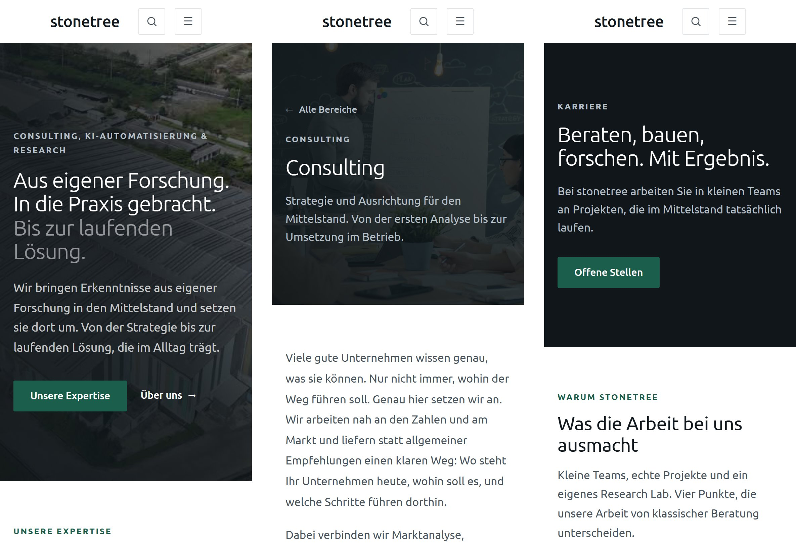

## Grenzen der Prüfung

Nicht von Hand geprüft wurden die Bedienung der Ausklappmenüs mit der Tastatur in verschiedenen Browsern und die Darstellung in Safari. Die Tastaturprüfung der Reiter lief nur in Chrome. Die Netzwerkdrosselung wurde über Lighthouse nachgestellt, nicht auf echten Mobilgeräten getestet. Diese Punkte stehen in der Liste offener Punkte.

# Betrieb und Deployment

## Anforderungen an den Betrieb

Für die Veröffentlichung ergaben sich zwei Anforderungen. Die Website soll dauerhaft unter einer Domain des Betreuers erreichbar sein, die bei IONOS registriert ist. Gleichzeitig soll kurzfristig eine erreichbare Fassung existieren, falls die Einrichtung dieser Domain zeitlich nicht rechtzeitig gelingt. Daraus folgt ein gestuftes Vorgehen mit drei Veröffentlichungswegen, die alle auf demselben Code beruhen.

Tabelle: Veröffentlichungswege im Vergleich

| Weg | Backend | Kontaktformular | Einsatz |
| --- | --- | --- | --- |
| A. GitHub Pages | nein | öffnet das E-Mail-Programm | seit 04.10.2026 aktiv, Rückfallebene |
| B. IONOS-Domain | je nach Paket | E-Mail-Programm oder Backend | endgültige Adresse |
| C. Eigener Server mit Docker | ja | Versand über das Backend | voller Funktionsumfang |

## Veröffentlichung über GitHub Pages

GitHub Pages liefert ausschließlich statische Dateien aus [25]. Das FastAPI-Backend steht dort nicht zur Verfügung. Damit die Website trotzdem vollständig nutzbar bleibt, wurden drei Anpassungen vorgenommen.

Erstens liegt eine Projektseite auf GitHub Pages in einem Unterordner, etwa unter `/h2h-consulting/`. Alle Verweise auf Bilder, Videos und PDFs laufen deshalb über eine Hilfsfunktion `publicUrl()`, die den Unterordner aus der Build-Konfiguration voranstellt. Der Router erhält denselben Unterordner als Basis. Zweitens kennt GitHub Pages keine Weiterleitung unbekannter Pfade auf die Startseite. Der Build legt deshalb eine Kopie der Startseite als `404.html` ab, sodass auch Unterseiten beim direkten Aufruf funktionieren. Drittens erkennt das Kontaktformular, wenn kein Backend konfiguriert ist. Es öffnet dann das E-Mail-Programm mit vorausgefüllter Nachricht, statt einen Fehler anzuzeigen.

Der Ablauf ist automatisiert. Ein Workflow mit GitHub Actions baut die Website bei jedem Push auf den Hauptzweig, führt dabei die Typprüfung aus und veröffentlicht das Ergebnis. Die Versionsverwaltung bleibt auf dem GitLab der Hochschule, GitHub ist als zweites Ziel eingetragen.

## Ergebnis der Veröffentlichung

Die Website ist seit dem 4. Oktober 2026 unter https://ahuemmer3.github.io/Stonetree.Consulting/ öffentlich erreichbar. Der Unterordner `/Stonetree.Consulting/` ergibt sich aus dem Namen des Repositorys und wird vom Workflow automatisch gesetzt.

Der erste Durchlauf des Workflows schlug fehl. Der Build war erfolgreich, die Veröffentlichung brach jedoch mit dem Hinweis ab, dass GitHub Pages im Repository nicht aktiviert war. GitHub Pages muss vor der ersten Veröffentlichung in den Einstellungen des Repositorys auf die Quelle GitHub Actions umgestellt werden. Nach dieser Einstellung lief der wiederholte Durchlauf fehlerfrei. Die Hosting-Anleitung weist auf diesen Schritt hin.

Nach der Veröffentlichung wurde die Website im Browser geprüft. Tabelle 23 fasst das Ergebnis zusammen.

Tabelle: Prüfung der veröffentlichten Website

| Prüfung | Ergebnis |
| --- | --- |
| Startseite mit Hintergrundvideo | lädt vollständig, Status 200 |
| Bilder, Videos und PDFs im Unterordner | erreichbar, Status 200 |
| Direkter Aufruf einer Unterseite, z. B. /bereiche/consulting | richtige Seite über 404.html, technisch Status 404 |
| Impressum mit Hinweis auf die fiktive Website | angezeigt |
| Ausschluss aus Suchmaschinen | Anweisung noindex im Quelltext vorhanden |

Der Status 404 beim direkten Aufruf von Unterseiten ist eine bekannte Einschränkung von GitHub Pages. Für Besucher ist sie nicht sichtbar. Suchmaschinen würden solche Seiten zwar nicht aufnehmen, das ist bei der fiktiven Website aber ohnehin gewollt. Beim späteren Betrieb unter der IONOS-Domain mit Webspace oder eigenem Server entfällt die Einschränkung, weil dort echte Weiterleitungen möglich sind.

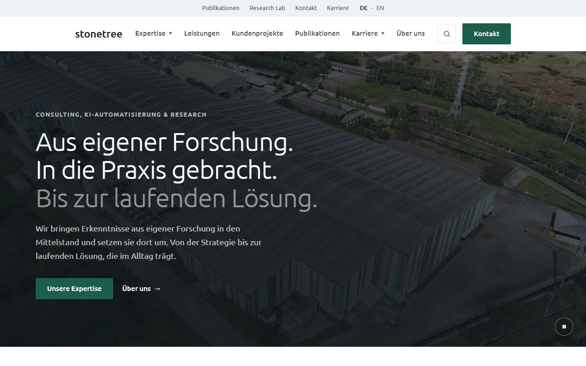

## Umzug auf die IONOS-Domain

Für die endgültige Adresse kommen je nach gebuchtem IONOS-Paket drei Varianten in Frage. Ist nur die Domain vorhanden, verweist ein DNS-Eintrag (CNAME) einer Subdomain auf GitHub Pages. Die Website bleibt dann technisch auf GitHub Pages, ist aber unter der Domain des Betreuers mit automatisch ausgestelltem HTTPS-Zertifikat erreichbar. Über eine Variable im Repository wird der Unterordner auf die Wurzel umgestellt. Bei einem IONOS-Webspace wird die gebaute Website per SFTP hochgeladen. Eine vorbereitete `.htaccess` übernimmt dort die Weiterleitung unbekannter Pfade. Bei einem IONOS-Server ist schließlich der Docker-Betrieb aus Abschnitt 8.5 möglich.

## Betrieb mit eigenem Server

Für den vollen Funktionsumfang laufen Website und Backend auf einem eigenen Server in zwei Containern. Der Webserver Caddy liefert die gebaute Website aus, besorgt automatisch ein HTTPS-Zertifikat und leitet alle Anfragen unter `/api` an das Backend weiter [20]. Da Website und Backend unter derselben Domain laufen, ist keine Freigabe für fremde Ursprünge (CORS) nötig.

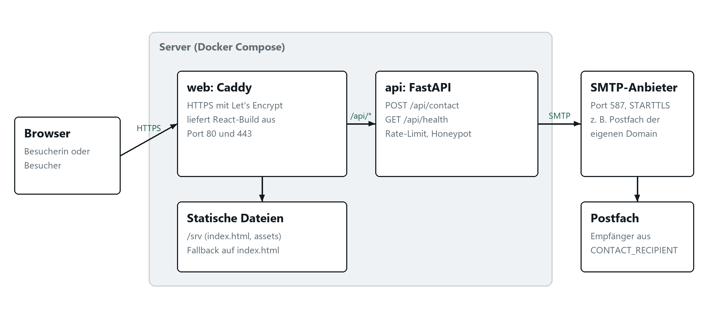

Tabelle: Dateien für den Betrieb

| Datei | Zweck |
| --- | --- |
| .github/workflows/pages.yml | baut und veröffentlicht die Website auf GitHub Pages |
| deploy/apache/.htaccess | Weiterleitung und Cache-Regeln für Apache-Webspace |
| docker-compose.yml | startet beide Container |
| frontend/Dockerfile | baut die Website und liefert sie mit Caddy aus |
| backend/Dockerfile | startet FastAPI als Benutzer ohne Administratorrechte |
| deploy/Caddyfile | Domain, HTTPS, Sicherheitsheader, Weiterleitung von /api |
| .env.example | Vorlage für Domain und SMTP-Zugangsdaten |

Der Livegang auf einem eigenen Server folgt der Anleitung in `docs/hosting.md`: Server bereitstellen und die Firewall auf die Ports 22, 80 und 443 beschränken, Domain per A-Record verweisen, Zugangsdaten in der Datei `.env` hinterlegen und die Container mit `docker compose up -d --build` starten. Für den Mailversand wird Port 587 mit STARTTLS verwendet, weil Hosting-Anbieter ausgehende Verbindungen auf Port 25 und 465 häufig sperren.

## Besonderheiten einer fiktiven Website

Zwei Punkte betreffen alle Veröffentlichungswege. Erstens darf das fiktive Unternehmen nicht in Suchergebnissen erscheinen, wo es für echt gehalten werden könnte. Jede Seite trägt deshalb die Anweisung `noindex, nofollow` für Suchmaschinen. Zweitens werden Schriften derzeit von Google Fonts geladen. Nach der Rechtsprechung des LG München I ist die Weitergabe der IP-Adresse an Google ohne Einwilligung problematisch [22]. Vor einer dauerhaften Veröffentlichung sollte die Schrift deshalb selbst ausgeliefert werden.

# Einsatz von KI-Werkzeugen

## Offenlegung

Im Projekt wurde das große Sprachmodell Claude des Unternehmens Anthropic eingesetzt [23]. Die Nutzung erfolgte über Claude Code, eine Erweiterung für die Entwicklungsumgebung Visual Studio Code, die Dateien des Projekts lesen, Befehle ausführen und Änderungen vorschlagen oder vornehmen kann [24]. Dieses Kapitel legt offen, wofür das Werkzeug eingesetzt wurde, wie die Ergebnisse geprüft wurden und wo seine Grenzen lagen.

## Einsatzbereiche

Tabelle: Einsatz von Claude nach Aufgabenbereich

| Bereich | Beispiele | Anteil der Eigenleistung |
| --- | --- | --- |
| Programmierung | Migration von JavaScript zu TypeScript, Aufteilung in Komponenten und Features, Hintergrundvideo, Karussell, Stellenfilter, Diagramm, FastAPI-Backend mit Tests | Vorgaben zu Architektur und Codequalität, Prüfung und Abnahme jeder Änderung |
| Gestaltung | Umsetzung der Farbvorgaben als Tokens, Berechnung von Kontrasten, Anpassung an Breakpoints | Gestaltungsentscheidungen, Auswahl der Varianten, Abstimmung mit dem Auftraggeber |
| Inhalte | Entwürfe für Texte der Bereichsseiten, Leistungen, Karriereseite und FAQ, Sprachdurchgang nach den Sprachregeln, Neufassung der Bereichsseiten mit konkreten Leistungen | Positionierung, Vorgabe der Leistungsfelder (etwa SAP-Beratung und Logistik-Templates), Freigabe und Überarbeitung der Texte |
| Recherche | strukturierte Analyse von Referenzwebsites, Recherche zu KI im Mittelstand, zur KI-Verordnung, zum SAP-Wartungsende und zu realen Angeboten von SAP- und Logistikberatungen | Auswahl der Vorbilder, Entscheidung über Übernahme oder Verzicht |
| Medien | Skripte zur Bild- und Videoaufbereitung, Zuschnitt des Logos und Erzeugung der Favicons | Auswahl der Motive und Quellen |
| Qualitätssicherung | Lighthouse-Messungen, Screenshots, Kontrastprüfung, Tastaturtest der Reiter, Prüfung der veröffentlichten Website, Ausführen von Typprüfung, Linter und Tests | Bewertung der Ergebnisse |
| Dokumentation | fortlaufendes Änderungsprotokoll, Hosting-Anleitung, Überarbeitung dieser Projektdokumentation | Struktur, inhaltliche Prüfung, Endfassung |
| Betrieb | Einrichtung von GitHub Pages mit Workflow, Anpassung an den Unterordner, Vorbereitung für IONOS | Anlage des Repositorys, Aktivierung von GitHub Pages, Freigabe der Veröffentlichung |

## Arbeitsweise

Die Zusammenarbeit folgte einem festen Muster. Der Autor formulierte eine Aufgabe in natürlicher Sprache, etwa eine Anforderung aus der Abstimmung mit dem Auftraggeber. Claude analysierte den bestehenden Code, schlug eine Lösung vor und setzte sie nach Freigabe um. Anschließend wurde das Ergebnis durch Typprüfung, Build, Tests und Sichtkontrolle im Browser überprüft. Erst danach übernahm der Autor die Änderung in die Versionsverwaltung.

Für eine gleichbleibende Qualität wurden dem Werkzeug feste Vorgaben gemacht. Dazu gehörten wartbarer, nach Features gegliederter Code, die Trennung von Logik und Darstellung, die Berücksichtigung der Barrierefreiheit und die Sprachregeln aus Abschnitt 4.4. Diese Vorgaben sind im Projekt als dauerhafte Hinweise für das Werkzeug hinterlegt.

## Kritische Reflexion

Der Einsatz brachte einen deutlichen Zeitgewinn bei wiederkehrenden Aufgaben wie der Typisierung von Datenmodellen, der Aufteilung von Komponenten oder dem Schreiben von Tests. Ebenso hilfreich war die Möglichkeit, Messungen wie Kontrastberechnungen über alle Bilder eines Videos automatisiert durchzuführen, die von Hand kaum praktikabel wären.

Dem stehen bekannte Grenzen großer Sprachmodelle gegenüber. Sprachmodelle können plausibel klingende, aber falsche Aussagen erzeugen. Deshalb wurden Fakten, Quellen und Rechtsfragen gesondert geprüft. Ein Beispiel aus dieser Dokumentation: Die im August protokollierte Darstellung der Einstiegsphasen bei CodeCamp:N ließ sich im Oktober nicht mehr bestätigen und ist entsprechend gekennzeichnet. Bei der Neufassung der Bereichsseiten wurde ein zunächst erwogener Anwendungsfall, die automatische Vorauswahl von Bewerbungen, wieder verworfen, weil KI-Systeme im Personalbereich nach der KI-Verordnung als Hochrisiko-Systeme gelten [8]. Rechtliche Texte wie das Impressum wurden bewusst als Musterdaten angelegt. Für eine echte Website ersetzt das Werkzeug keine Rechtsberatung. Texte aus Sprachmodellen neigen zudem zu Floskeln. Die Sprachregeln und ein eigener Sprachdurchgang wirkten dem entgegen.

Die Verantwortung für alle Inhalte, Entscheidungen und das Ergebnis liegt beim Autor. Claude wurde als Werkzeug eingesetzt, vergleichbar mit einer Entwicklungsumgebung oder einer Suchmaschine, nicht als Urheber der Arbeit.

# Fazit und Ausblick

## Zusammenfassung

Die Arbeit hat gezeigt, wie sich das Alleinstellungsmerkmal eines Beratungsunternehmens in eine Website übersetzen lässt. Ausgangspunkt war eine Analyse etablierter Beratungswebsites. Sie zeigte, dass große Anbieter Kompetenz durch Fallbeispiele, Publikationen und eigene Forschungsinstitute belegen. Für stonetree wurde daraus die Positionierung über das Research Lab abgeleitet und konsequent auf alle Seiten übertragen. In der letzten Phase zeigte sich, dass eine klare Positionierung allein nicht genügt. Erst die Benennung konkreter Leistungen wie SAP-Beratung, Logistik-Templates und einzelner KI-Anwendungsfälle macht das Angebot für die Zielgruppe greifbar. Die Bereichsseiten wurden deshalb kürzer und konkreter gefasst.

Alle vier Ziele aus Abschnitt 1.2 wurden erreicht, das vierte mit Einschränkung. Die Positionierung ist auf allen Seiten umgesetzt. Struktur und Gestaltung orientieren sich nachvollziehbar an Vorbildern, ohne Inhalte zu kopieren. Inhalte sind in typisierten Datenmodellen änderbar, ohne Komponenten anzufassen. Die Website ist seit dem 4. Oktober 2026 über GitHub Pages öffentlich erreichbar. Der Betrieb mit eigenem Backend ohne weitere Fremddienste ist vorbereitet, der Umzug auf die endgültige Domain steht noch aus.

## Offene Punkte

Tabelle: Offene Punkte

| Punkt | Zuständig | Bemerkung |
| --- | --- | --- |
| Umzug auf die IONOS-Domain | Umsetzung mit Betreuung | gebuchtes IONOS-Paket klären, dann passende Variante |
| Schrift selbst ausliefern | Umsetzung | derzeit über Google Fonts |
| Datenschutzhinweise | Umsetzung | müssen Kontaktformular und Mailanbieter nennen |
| Tastaturtest im echten Browser | Umsetzung | Ausklappmenüs bisher nur im Code geprüft |
| Eigene Fotos und Videos | Auftraggeber | derzeit freie Stockbilder |
| Entscheidung Logo und Akzentfarbe | Auftraggeber | Vorschau unter /marke, Vergleich als Screenshot |

## Ausblick

Für eine Weiterentwicklung bieten sich drei Richtungen an. Erstens eine englische Fassung, für die die Sprachwahl in der Servicezeile bereits vorbereitet ist. Zweitens eine Suchfunktion, deren Platz in der Navigation ebenfalls angelegt ist. Drittens die ursprünglich geplante Registrierung mit Datenbank, sobald ein geschützter Bereich fachlich benötigt wird. Durch die Trennung von Daten, Logik und Darstellung lassen sich diese Erweiterungen ergänzen, ohne die bestehende Struktur umzubauen.

# Quellenverzeichnis {-}

<!-- quellen -->

[1] Roland Berger GmbH: Website. https://www.rolandberger.com/de/, abgerufen am 04.10.2026.

[2] The Boston Consulting Group: Website. https://www.bcg.com/de-de/, abgerufen am 04.10.2026.

[3] The Boston Consulting Group: BCG Henderson Institute. https://www.bcg.com/bcg-henderson-institute, abgerufen am 04.10.2026.

[4] The Boston Consulting Group: Careers. https://careers.bcg.com/, abgerufen am 04.10.2026.

[5] McKinsey & Company: McKinsey Global Institute. https://www.mckinsey.com/mgi, abgerufen am 04.10.2026.

[6] Capgemini Deutschland GmbH: Website. https://www.capgemini.com/de-de/, abgerufen am 04.10.2026.

[7] CodeCamp:N GmbH: Website. https://www.codecamp-n.com/, abgerufen am 04.10.2026.

[8] Verordnung (EU) 2024/1689 des Europäischen Parlaments und des Rates vom 13. Juni 2024 zur Festlegung harmonisierter Vorschriften für künstliche Intelligenz (Verordnung über künstliche Intelligenz). ABl. L, 2024/1689, 12.07.2024.

[9] Unsplash: Unsplash License. https://unsplash.com/license, abgerufen am 04.10.2026.

[10] Pexels: Pexels License. https://www.pexels.com/license/, abgerufen am 04.10.2026.

[11] Digitale-Dienste-Gesetz (DDG) vom 6. Mai 2024, § 5 Allgemeine Informationspflichten. BGBl. 2024 I Nr. 149.

[12] Medienstaatsvertrag (MStV) vom 14. bis 28. April 2020, § 18 Abs. 2.

[13] World Wide Web Consortium (W3C): Web Content Accessibility Guidelines (WCAG) 2.2. W3C Recommendation, 2023. https://www.w3.org/TR/WCAG22/, abgerufen am 04.10.2026.

[14] Meta Platforms: React Documentation. https://react.dev/, abgerufen am 04.10.2026.

[15] Microsoft: TypeScript Documentation. https://www.typescriptlang.org/docs/, abgerufen am 04.10.2026.

[16] Vite: Vite Documentation. https://vite.dev/guide/, abgerufen am 04.10.2026.

[17] Tailwind Labs: Tailwind CSS Documentation. https://tailwindcss.com/docs, abgerufen am 04.10.2026.

[18] Ramírez, S.: FastAPI Documentation. https://fastapi.tiangolo.com/, abgerufen am 04.10.2026.

[19] Docker Inc.: Docker Compose Documentation. https://docs.docker.com/compose/, abgerufen am 04.10.2026.

[20] Caddy: Caddy Documentation. https://caddyserver.com/docs/, abgerufen am 04.10.2026.

[21] Google: Lighthouse Overview. https://developer.chrome.com/docs/lighthouse/overview, abgerufen am 04.10.2026.

[22] Landgericht München I, Urteil vom 20.01.2022, Az. 3 O 17493/20.

[23] Anthropic: Claude. https://www.anthropic.com/claude, abgerufen am 04.10.2026.

[24] Anthropic: Claude Code Documentation. https://docs.anthropic.com/en/docs/claude-code/overview, abgerufen am 04.10.2026.

[25] GitHub: GitHub Pages Documentation. https://docs.github.com/en/pages, abgerufen am 04.10.2026.

[26] part: SAP ECC-Wartungsende 2027. https://www.part.de/en/blog/sap-wartungsende-2027-umstieg-s4hana, abgerufen am 04.10.2026.

[27] mind logistik: SAP EWM Beratung, Rollout und Standardisierung eines Logistik-Templates bei der Gebr. Knauf KG. https://mind-logistik.de/referenz/sap-ewm-beratung-rollout-standardisierung-eines-logistik-templates-bei-der-gebr-knauf-kg/, abgerufen am 04.10.2026.

[28] automationflow: KI Use Cases Mittelstand 2026. https://www.automationflow.de/wissen/ki-use-cases-mittelstand-2026-der-praxis-guide, abgerufen am 04.10.2026.

[29] World Wide Web Consortium (W3C): ARIA Authoring Practices Guide, Tabs Pattern. https://www.w3.org/WAI/ARIA/apg/patterns/tabs/, abgerufen am 04.10.2026.

# Anhang {-}

## A Ablage der Inhalte {-}

Tabelle: Ablage der wichtigsten Inhalte im Repository

| Thema | Datei |
| --- | --- |
| Texte der Bereiche | frontend/src/data/pillars.ts |
| Leistungen | frontend/src/data/leistungen.ts |
| Kundenprojekte | frontend/src/data/kundenprojekte.ts |
| Publikationen | frontend/src/data/publications.ts |
| Karriereseite und Stellen | frontend/src/data/karriere.ts, jobs.ts |
| Diagrammdaten | frontend/src/data/aufwand.ts |
| Marke und Impressum | frontend/src/data/site.ts |
| Farben und Maße | frontend/src/styles/tokens.css |
| Video- und Bildaufbereitung | frontend/scripts/ |
| Bildnachweis | frontend/public/images/BILDNACHWEIS.txt |
| Änderungsprotokoll | UMSETZUNG.md |
| Hosting-Anleitung | docs/hosting.md |
| Quelle dieser Dokumentation | docs/dokumentation/ |

## B Befehle {-}

Tabelle: Wichtige Befehle

| Zweck | Befehl |
| --- | --- |
| Entwicklung starten | cd frontend && npm run dev |
| Build erzeugen | npm run build |
| Typen prüfen | npm run typecheck |
| Linter | npx oxlint src |
| Backend-Tests | cd backend && pytest |
| Veröffentlichen auf GitHub Pages | git push github main |
| Betrieb mit eigenem Server | docker compose up -d --build |
| Dokumentation erzeugen | python docs/dokumentation/build_docx.py |

## C Quellen der Medien {-}

Alle Bilder und Videos stammen von Unsplash und Pexels. Beide Lizenzen erlauben die kommerzielle Nutzung ohne Genehmigung, eine Namensnennung ist erwünscht [9][10]. Die vollständige Liste mit Urhebern steht in `BILDNACHWEIS.txt`. Die beiden Videoclips zeigen eine Fabrikhalle aus der Luft und die Fassade eines Bürohochhauses.
